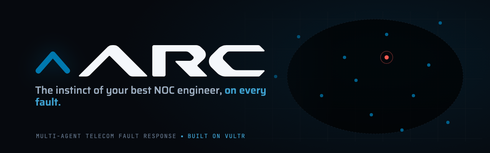
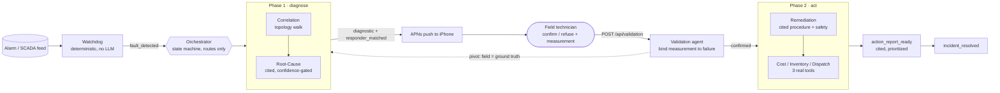

**[▶ Watch the 60-second demo](https://youtu.be/ohvx1NQniWc)**

# Arc

**Multi-agent network operations for telecom site fault response** — RAISE Summit, Vultr track.

A deterministic **Watchdog** ingests the site alarm feed and triggers an **Orchestrator**
(a strict state machine that routes but never diagnoses) running specialist agents in two
phases — *diagnose* then *act* — around a **human validation loop on a native iOS app**. All
reasoning runs on **Vultr Serverless Inference**, grounded via **VultronRetriever** in real
telecom documents. The output is a prioritized action report with a full, clickable citation
trail.

## Three hero features

- **Matchmaking dispatch** — routed to the *one* right technician by skill and zone, not broadcast to the whole crew.
- **Physical validation loop** — the technician tests on site and confirms, or refuses with a counter-measurement and the agent **pivots** and re-diagnoses live.
- **Document-grounded reasoning** — every cause and every step cites the carrier's own technical docs, down to the page, clickable in the report.

## Architecture



Everything the UI shows is the live SSE event stream (the frozen 15-event contract in
[`contracts/EVENTS.md`](contracts/EVENTS.md)); the web control room and the iOS app are pure
consumers of that stream. The demo always terminates — a failed agent degrades to a
schema-valid *downgraded* report rather than stalling. Full detail in
[docs/ARCHITECTURE.md](docs/ARCHITECTURE.md).

## Quickstart

```sh
# 1. Backend — Python 3.12+, .env filled with Vultr keys (see .env.example)
python -m uvicorn backend.app.main:app --port 8000

# 2. Frontend
cd frontend && npm install && npm run dev          # http://localhost:3000

# 3. iOS — open ios/Arc.xcodeproj in Xcode, Run to a plugged-in iPhone,
#    then gear → set Backend to the Mac's LAN IP (e.g. http://192.168.1.10:8000)

# 4. Sign in at /login, open /monitor, switch to the Technical view, Stream on.

# 5. Inject the incident (or press "Run incident" in the control room):
curl -X POST http://127.0.0.1:8000/api/demo/inject-fault \
  -H 'Content-Type: application/json' -d '{"scenario":"confirm"}'
```

The agents diagnose live, the push lands on the phone, the technician **Validates** (or
**Refuses** with a counter-measurement — use `{"scenario":"pivot"}` — to drive the
re-diagnosis), and the finale is a cited action report you can open and export as PDF. No
backend or phone? A fully-offline replay is described in [docs/FRONTEND.md](docs/FRONTEND.md).

## Documentation

Full index (with the pitch script, agents spec, and architecture diagram) in
[docs/README.md](docs/README.md).

| Doc | Covers |
|---|---|
| [docs/ARCHITECTURE.md](docs/ARCHITECTURE.md) | The whole system: Watchdog → Orchestrator → phase-1/phase-2 agents, the state machine, the five principles. |
| [docs/AGENTS.md](docs/AGENTS.md) | Each specialist agent (Correlation, Root-Cause, Validation, Remediation, Cost/Inventory/Dispatch, Responder-Matching) and its contract. |
| [docs/BACKEND-API.md](docs/BACKEND-API.md) | The FastAPI endpoints, the SSE event contract, and the push service. |
| [docs/VULTR.md](docs/VULTR.md) | The Vultr Serverless Inference client, the pinned model, the concurrency guard. |
| [docs/CORPUS.md](docs/CORPUS.md) | The grounding corpus, the retriever, the `doc_id` namespace and citation trail. |
| [docs/FRONTEND.md](docs/FRONTEND.md) | The Next.js control room: pages, Simple/Technical views, SSE client, citation/PDF viewer. |
| [docs/IOS.md](docs/IOS.md) | The SwiftUI operator app: screens, APNs flow, validation payloads, build, device setup. |
| [docs/MILESTONES.md](docs/MILESTONES.md) | How Arc was built, milestone by milestone (M1–M8). |
| [docs/arc-pitch-scenario-3min.md](docs/arc-pitch-scenario-3min.md) | The beat-by-beat 3-minute demo script. |

## Stack & Vultr compliance

Backend: Python 3.12 · FastAPI · SSE. Agents: **Vultr Serverless Inference** (pinned
`deepseek-ai/DeepSeek-V4-Flash`) + **VultronRetriever** for grounding. Frontend: Next.js 15 ·
React 19 · TypeScript · Tailwind. iOS: native SwiftUI (APNs).

**All agent reasoning runs on Vultr Serverless Inference**, grounded in real documents via
VultronRetriever — see [docs/VULTR.md](docs/VULTR.md). Arc is a genuine multi-step agent
(it plans, retrieves more than once behind a confidence gate, calls real tools, decides, and
emits a prioritized action report): not a basic RAG app, not a dashboard, not an image
analyzer (agents reason over structured data, never pixels). Public repo, new work only —
built entirely at the event.

## Repo layout

```text
backend/    FastAPI runtime — Watchdog, Orchestrator, SSE bus, push, tools, adapters
agents/     specialist agents + the shared Vultr client, retriever, corpus builder
contracts/  frozen schemas (events, push, validation), agent interface, mock stream
data/       telecom seed data + grounding corpus
frontend/   Next.js control room (landing + live monitor + reports)
ios/         native SwiftUI operator app (APNs validate/refuse)
validation/ eval spec, ground-truth scenarios, retriever brief
docs/       project documentation (index in docs/README.md)
```

## Requirements

- **Python ≥ 3.12.** The codebase uses PEP 604 `X | None` annotations evaluated at runtime, so the macOS system `python3` (3.9) crashes on import. `.python-version` pins `3.12` for pyenv; use it (or any 3.12+) for every lane (backend, agents, contracts).
- Copy [`.env.example`](.env.example) to a local `.env` and fill secrets there — never commit `.env` (the repo is public).

## Team

| | |
|---|---|
| vgtray | Agentic AI & workflows (lead) |
| aminssutt | Agentic AI & workflows |
| simerugby | Backend |
| daniwavy5032 | Control-room web + iOS app |
| designspear-epic | Design & UI/UX |

Board: https://github.com/users/aminssutt/projects/3
