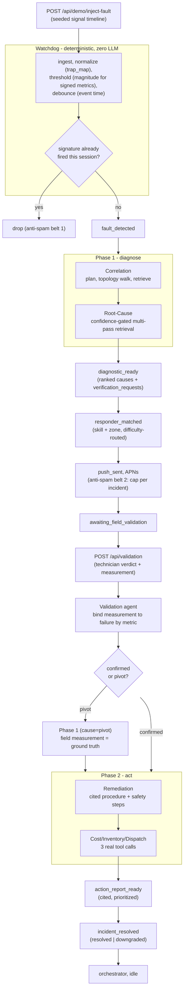
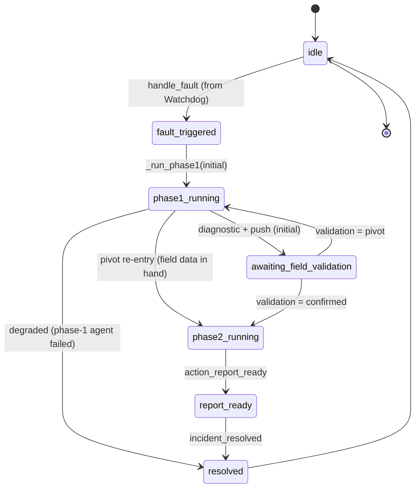

# Arc — System Architecture

Arc is a multi-agent responder for telecom-site faults. A deterministic Watchdog
turns raw alarm signals into a debounced fault; an Orchestrator (a strict state
machine that routes but never diagnoses) drives two phases of specialized agents
around a single human-in-the-loop field check. Every load-bearing claim is
grounded in a cited corpus, and every event is streamed live over SSE.

This document is the map: the end-to-end pipeline, the orchestrator state
machine, and the five architectural principles that make the system honest under
failure. Per-agent detail is in [AGENTS.md](AGENTS.md); the HTTP surface is in
[BACKEND-API.md](BACKEND-API.md); the Vultr integration is in [VULTR.md](VULTR.md);
the corpus is in [CORPUS.md](CORPUS.md).

## The pipeline at a glance

- **Phase 1 — diagnose:** Correlation localizes the fault on the topology,
  Root-Cause ranks causes behind a confidence-gated multi-pass retrieval loop.
  The result is a cited diagnostic plus a *verification request* — one physical
  measurement a technician can take to confirm or refute it.
- **Human loop:** the diagnosed incident is pushed to the matched responder's
  iPhone (APNs). The technician confirms the diagnosis, or rejects it with a
  counter-measurement.
- **Phase 2 — act:** on `confirmed`, Remediation grounds a cited repair
  procedure and Cost/Inventory/Dispatch calls three real tools to price the fix,
  match the part to stock, and book a crew. The output is a prioritized,
  fully-cited action report.
- **The pivot:** on `rejected`, the field measurement becomes ground truth and
  Phase 1 re-runs (`cause="pivot"`). Because the field data is already in hand,
  the re-diagnosis flows straight into Phase 2 with no second push loop.

## End-to-end flow

Every box above emits one or more SSE events (see the 15-event catalog in
[`contracts/EVENTS.md`](../contracts/EVENTS.md)); the web control room and the
iOS app are pure consumers of that stream plus a small set of additive HTTP
endpoints ([BACKEND-API.md](BACKEND-API.md)).

## Orchestrator state machine

The Orchestrator (`backend/app/orchestrator.py`) holds all incident state and
routes agents, but contains **no domain judgement** — every value in an emitted
event comes from an agent payload or a seed. Transitions are asserted against a
frozen table (`TRANSITIONS`); an illegal transition raises `IllegalTransition`
rather than silently proceeding.

Canonical state constants (`orchestrator.py`): `idle`, `fault_triggered`,
`phase1_running`, `awaiting_field_validation`, `phase2_running`, `report_ready`,
`resolved`. Notable edges:

- **`phase1_running -> phase2_running`** is the pivot re-entry: after a pivot the
  field measurement already exists, so the re-diagnosis proceeds to Phase 2
  without a second `awaiting` / push cycle.
- **`phase1_running -> resolved`** and **`phase2_running -> report_ready`
  (degraded)** are the graceful-degradation terminals — see below.
- Only **one incident at a time**: `handle_fault` returns immediately if the
  state is not `idle`; the signal feed keeps flowing and additional failures
  attach to the active incident via `add_failures`.

### Agents run behind a frozen, timeout-safe protocol

Agents are pluggable through the frozen `contracts.Agent` protocol (`name` +
`async run(AgentInput) -> AgentOutput`). The runtime only ever awaits `run`; it
never imports a concrete agent. `_run_agent` wraps every call in
`asyncio.wait_for(..., timeout=agent_timeout_s)` (default 120 s). A timeout or an
exception becomes an `agent_completed` event with `status=timeout|error` — never
a crash. The registry is assembled in `backend/app/main.py`, where real
Vultr-backed agents replace dummies as a Vultr key is detected (see
[VULTR.md](VULTR.md) and [AGENTS.md](AGENTS.md)).

## Architectural principles

### 1. Event-driven (SSE)

The single source of truth for the UI is the event stream. The `EventBus`
(`backend/app/bus.py`) builds a frozen envelope `{seq, id, ts, incident_id,
type, data}` for every event, keeps a full history, and fans out to all SSE
subscribers. `seq` is per-incident and gapless; `id` doubles as the SSE `id:` for
`Last-Event-ID` resume. `GET /api/stream` replays history on connect, then streams
live, with a `: hb` heartbeat comment every `heartbeat_s` (default 15 s). The
frontend and iOS apps swap the mock replay stream for the live backend by
changing the base URL only — the wire format is identical.

### 2. Frozen contracts

Three machine-readable schemas are frozen after phase 0 and enforced at runtime,
not by convention:

- `contracts/events.schema.json` — the 15-event SSE envelope.
- `contracts/push_payload.schema.json` — validated before every push (`PushService`
  raises on a violation: an invalid push is a contract break, caught in dev).
- `contracts/validation_event.schema.json` — validated on every `POST /api/validation`
  (to 422 on violation).

The frozen `contracts.agent_interface` (`Agent`, `AgentInput`, `AgentOutput`,
`Citation`, `RetrievedRef`, the tool signatures) let the agent lane, the backend
lane, and the frontend build in parallel against stubs. Two Citation shapes
coexist by design — the agent shape `{doc_id, section, snippet?}` and the event
shape `{doc_id, claim, title?, page?}` — bridged by a deterministic transform in
the adapters and in `Orchestrator._event_citation` (see `contracts/decisions.md`).

### 3. Graceful degradation

The demo must always finish. No agent failure can leave an incident stuck:

- A **phase-1** agent returning nothing (`correlation` or `root_cause` failed or
  timed out) routes to `_terminate_degraded_phase1`: the incident closes with
  `incident_resolved` (`outcome="downgraded"`), no diagnosis, manual triage
  named in the summary.
- A **phase-2** agent failure routes to `_terminate_degraded`: a schema-valid
  *degraded* action report is still assembled from the phase-1 diagnosis (with a
  manual-intervention action), then `incident_resolved` (`downgraded`).
- `_ensure_steps` guarantees `procedure.steps` is never empty (the frozen schema
  requires `minItems >= 1`), and the degraded report falls back to a marker
  citation when phase-1 produced none.
- Below the orchestrator, every external dependency degrades honestly: no Vultr
  key -> Correlation runs offline, Root-Cause/Remediation stay dummy (backend
  still boots); a bad APNs key -> push falls back to file delivery; retrieval
  failure -> agents report reduced/ungrounded confidence rather than inventing
  citations.

### 4. Anti-spam — a double belt

Two independent guards prevent a replayed or repeated signal from spamming a
technician's phone:

- **Belt 1 — Watchdog signature dedup** (`watchdog.py`): a fault signature
  `(site_id, frozenset(alarm_codes))` that already fired an incident this session
  is recorded in `_fired_signatures` and never re-fires. `incident_closed` does
  *not* clear it (a consumed fault's replayed signals stay inert); only an
  explicit `reset()` re-arms the demo. A second concurrent site fault attaches to
  the active incident instead of opening a new one.
- **Belt 2 — push cap** (`push_service.py`): at most `push_max_per_incident`
  pushes per incident (default 2, covering initial + optional pivot) and a global
  `push_min_interval_s` minimum between any two pushes (default 10 s). A
  suppressed push returns `None` and emits no `push_sent`.

### 5. Field-truth-over-telemetry

The pivot is the system's headline behavior, and it hinges on interpreting the
field measurement in **physical magnitudes, computed in code** — never left to
the LLM to re-derive from a raw signed number. A -48 V DC plant reads negative;
the undervoltage alarm fires on `|v|` falling below the seeded threshold, so a
*larger* magnitude is *healthier*. `Orchestrator._interpret_measurements` looks
up each measurement's rule in the seeded alarm dictionary, computes
`abnormal`/`status` on magnitudes, and injects a structured verdict
(`measurement_interpretation`) into the pivot prompt. This is why a field reading
of -53.9 V is correctly understood as a healthy float bus contradicting a -45.0 V
telemetry undervoltage — not misread as "worse." The same magnitude convention is
applied by the Watchdog (`SIGNED_METRICS`) and by the Validation adapter (which
flips the seeded magnitude threshold to the signed field convention).

The pivot's honesty carries into the **final report** (`_assemble_report`):
because `_suspect_part()` returns `None` after a pivot, the part lookup follows
the re-diagnosed cause's own supervision module (**SP2-MU**, absent from stock ->
a clean out-of-stock) instead of the rectifier spare, and the cost-avoided figure
is re-based to the needless emergency replacement the false alarm would have
triggered (original topology part 769.04 + 2 h labor 71.46 + truck roll 325.00 =
1165.50 USD) rather than the outage cost. The confirm and pivot runs thus produce
visibly different, equally grounded reports — see the Cost/Inventory/Dispatch
chapter in [AGENTS.md](AGENTS.md).

## Where the pieces live

| Concern | Module |
|---|---|
| Deterministic fault detection | `backend/app/watchdog.py` |
| State machine + routing + report assembly | `backend/app/orchestrator.py` |
| Event envelope + SSE fan-out | `backend/app/bus.py` |
| Push (file / simctl / APNs) + anti-spam cap | `backend/app/push_service.py`, `backend/app/apns_client.py` |
| Device-token registry | `backend/app/device_store.py` |
| Seed loading (fail-loud) | `backend/app/seeds.py` |
| HTTP surface | `backend/app/api/routes_*.py`, `backend/app/main.py` |
| Real tools (cost / inventory / dispatch) | `backend/app/tools/` |
| Real agents to orchestrator adapters | `backend/app/*_adapter.py` |
| Specialized agents | `agents/correlation/`, `agents/root_cause/`, `agents/validation/`, `agents/remediation/`, `agents/cost_inventory/`, `agents/responder_matching/` |
| Vultr client + retriever + corpus builder | `agents/common/` |
| Frozen contracts | `contracts/` |
| Seed data + corpus | `data/` |
