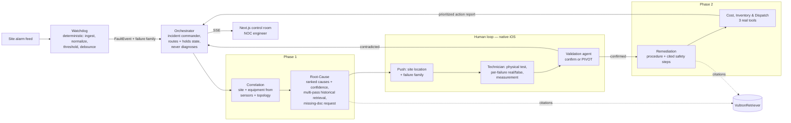

# Arc — Roadmap

> [!IMPORTANT]
> **RAISE Summit — Vultr track** · Team of 5, fully parallel lanes
> **Board:** https://github.com/users/aminssutt/projects/3 · **Repo:** github.com/aminssutt/Arc (PUBLIC)
> Phase timings are relative to the hackathon window (T0 = start).

Arc is a multi-agent **network operations agent for telecom site fault
response** (cell tower / base station / central office). A deterministic
Watchdog (no LLM) ingests the standardized site alarm feed and triggers an
Orchestrator that runs specialized agents in two phases, with a **human
validation loop on a native iOS app** in the middle: the field technician
receives a push (site location + detected failure family), validates each
detected failure as real/false after the physical test, and reports the real
measurement from the app. All reasoning runs on **Vultr Serverless Inference**
(single pinned model), grounded via **VultronRetriever** in real telecom
operations documents (RAN manuals, site power-plant specs, alarm dictionary,
vendor SLAs, tower maintenance logs, outage reports, past incident tickets).
Final output: a **prioritized action report** with a full citation trail —
diagnosis, remediation, cost avoided, part matched to stock, field crew booked.

## Big picture

## Fault taxonomy (drives detection, push content, injected faults)

| Family | Examples | Demo status |
|---|---|---|
| **Energy / power** (demo core) | grid loss, rectifier failure, degraded backup batteries, -48V DC plant voltage anomalies, blown fuse / tripped breaker, genset failure | **Injected live** |
| Environment / physical | HVAC failure + thermal shutdown of radios, temp/humidity/water intrusion, door/intrusion, smoke | **Injected live** (thermal) |
| RF / radio | cell down / sleeping cell, VSWR / feeder or antenna fault, return loss, GPS timing loss | Covered by architecture, framed honestly at pitch |
| Transport / connectivity | backhaul down (fiber cut, microwave), degradation (loss/latency/jitter), site router/switch failure | Covered by architecture, framed honestly at pitch |

Pitch beat: **voltage appears twice** — DC plant undervoltage (energy) and
VSWR on the antenna (RF) — the same agent reasons about two different voltage
faults.

## Phases

| Phase | Name | Budget (approx) | Gate to exit |
|---|---|---|---|
| 0 | Unblock | first ~3-4h (hard cap) | Contracts FROZEN (events + push payload + validation event), mock stream + push fixtures committed, Vultr smoke OK, one simulated push received in the iOS app |
| 1 | Parallel build | ~50% of window | Each lane demo-able standalone against mocks |
| 2 | Integration | ~25% of window | Both scenario runs complete LIVE end-to-end (push -> validation -> report) |
| 3 | Demo & pitch | ~15% of window | Backup video recorded, deck done, rehearsed |
| — | Buffer | last 2h | Code locked, no new features |

Dependency order: Phase 0 blocks everything. Inside phase 1, lanes are
independent by construction (frozen contracts + mock stream + push fixtures).
Cross-lane dependencies are explicit in the issues and minimal (Cost/Inventory/
Dispatch agent -> backend tools).

## Directories & ownership

| Directory | Owner | Content |
|---|---|---|
| `/agents` | vgtray + aminssutt | agents, common Vultr/retriever clients, orchestration glue |
| `/backend` | simerugby | FastAPI, watchdog, SSE, push service, validation intake, 3 tools, orchestrator runtime, data loading |
| `/frontend` | daniwavy5032 | Next.js control-room web (NOC monitoring) |
| `/ios` | daniwavy5032 | SwiftUI app: push handling, failures list, validation flow |
| `/design` | designspear-epic | direction, tokens, component specs, schematic asset, iOS screens |
| `/data` | shared (coordinated) | telecom corpus + scenario seeds — one owner per file, announce before editing |
| `/contracts` | FROZEN phase 0 | event schema, push payload, validation event, Agent/Tool interfaces, mock fixtures, decisions.md |
| `/docs` | vgtray | this roadmap, pitch, demo script |

Split inside `/agents` (the two agentic devs never edit the same file):
- **vgtray**: `/agents/correlation`, `/agents/root_cause`, `/agents/common/vultr.py`, `/agents/common/retriever.py`
- **aminssutt**: `/agents/validation`, `/agents/remediation`, `/agents/cost_inventory`, `/agents/orchestration`
- `/agents/common` base defined in phase 0, changed **only with a Discord heads-up**.

## Shared resources — producer / consumer table

| Resource | Producer (single owner) | Consumers | Frozen |
|---|---|---|---|
| Vultr Inference client (`/agents/common/vultr.py`) | vgtray | every agent (vgtray + aminssutt) | phase 0 |
| **Pinned Vultr model id + rate/concurrency budget** (`/contracts/decisions.md`) | vgtray | whole team | phase 0 |
| VultronRetriever client (`/agents/common/retriever.py`) | vgtray | Correlation, Root-Cause, any retrieving agent | phase 0 |
| Tool APIs: Cost Engine, Inventory Lookup, Crew Dispatch | simerugby (signatures in `/contracts`) | Cost/Inventory/Dispatch agent (aminssutt) | phase 0 |
| Event stream + event schema | simerugby | control-room web (mock in P1, real in P2) | phase 0 |
| Push payload + validation event | simerugby (`/contracts`) | iOS app consumes push, posts validation to intake | phase 0 |
| Agent interface (AgentInput/AgentOutput) | frozen in `/contracts` | all agents + orchestrator runtime | phase 0 |

One shared Vultr account, one API key, one credit pool: all agents use the
SAME pinned model id; the concurrency budget in `decisions.md` is binding so
5 people testing in parallel don't burn the credits.

## Secrets (repo is PUBLIC — zero tolerance)

| Secret | Owner | Lives in |
|---|---|---|
| Vultr API key | vgtray | local `.env` only |
| Apple dev account, APNs `.p8`, bundle id | designspear-epic (license holder) | local `.env` / keychain only |
| Tool/data API keys (if any) | simerugby | local `.env` only |

`.env.example` committed with blanked keys; `.env` and `*.p8` in `.gitignore`
from commit #1; check for hardcoded secrets before EVERY push. Never in a
client bundle (iOS included).

## Push strategy (de-risked)

The demo's primary push path is **`xcrun simctl push`** with the exact
contract payload — zero Apple account on the critical path. Real APNs
(token-based `.p8` auth, physical device) is a **stretch goal** wired late
with the designer's Apple license (see INT.7). If it doesn't land, the demo
runs on the simulator fallback and nothing breaks.

## No-conflict rules

1. Feature branch per person (`feat/<name>-<topic>`), PR to `main`, **no direct push to `main`**.
2. Nobody edits outside their directories. Cross-cutting need -> issue for the owner.
3. `/contracts` FROZEN after phase 0: change = PR + immediate Discord ping + producer AND consumers approve.
4. `/data`: one owner per file, announce on Discord before touching.
5. CODEOWNERS enforces review routing.

## How we work in parallel

- **Mock-first, both clients.** `/contracts/mock_stream/` ships two full
  scenario fixtures (`run_confirm.ndjson`, `run_pivot.ndjson`) + an SSE replay
  script -> the web app builds the whole experience with zero backend.
  `/contracts/push_fixtures/` ships the exact push payloads -> the iOS app is
  driven by `xcrun simctl push` with the same JSON, zero backend. Swapping to
  real = flag flip.
- **Frozen interfaces.** Orchestrator runs with dummy agents; agents run
  standalone via CLI harness; tools are stubbed from their frozen signatures.
  Nobody waits for anybody inside phase 1.
- **Load watch — daniwavy5032 owns web + iOS.** Flagged from day 0. Trim order
  if time runs short: (1) schematic lights-up interaction becomes
  post-hackathon, (2) control-room polish reduced to timeline + cards,
  (3) action report rendered as a plain card. The iOS validation flow is
  NEVER trimmed — it is the demo's human loop.
- **Sync points** (15 min, Discord): end of phase 0 (contract freeze review,
  all 5 approve) · mid phase 1 (lane demos on mocks) · start phase 2
  (integration order) · end of phase 2 (full E2E both runs, bug triage) ·
  phase 3 (rehearsal x2, video, lock).

## Risks

| Risk | Mitigation |
|---|---|
| Apple license lives with the designer, available late | simctl push is the PRIMARY demo path from phase 0; real APNs = stretch (INT.7) |
| Shared credit pool burned by parallel testing | Pinned model + binding concurrency budget + cached fixture replays for FE/iOS work |
| One owner for web + iOS | Load-shedding plan above, reviewed at each sync point |

## Compliance (every task — Vultr bar)

- **Multi-step agent**: plans, **retrieves more than once** when needed
  (Root-Cause confidence gate re-queries historical incident data), calls real
  tools (cost, inventory, crew dispatch), makes decisions, outputs a
  **prioritized action report a NOC team could actually use**. Never a single
  retrieve-then-answer call.
- Not a basic RAG app · not a dashboard (reasoning cockpit) · not an image
  analyzer — agents reason over code and structured data (topology, alarm
  feed, schematic points), never over pixels.
- Grounded in real telecom operations documents · public repo · new work only.

## Board

https://github.com/users/aminssutt/projects/3 — fields: **Status**, **Priority**
(P0/P1/P2), **Phase** (0-3), **Workstream**. Views: by Status (board), by
Assignee (table), by Phase (table). Labels mirror workstream, phase, priority.
